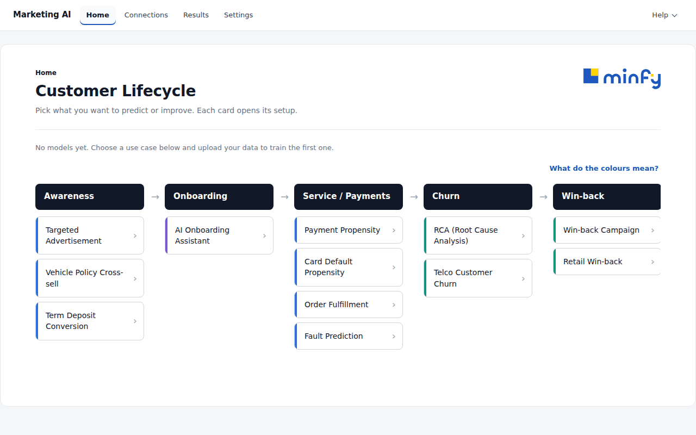
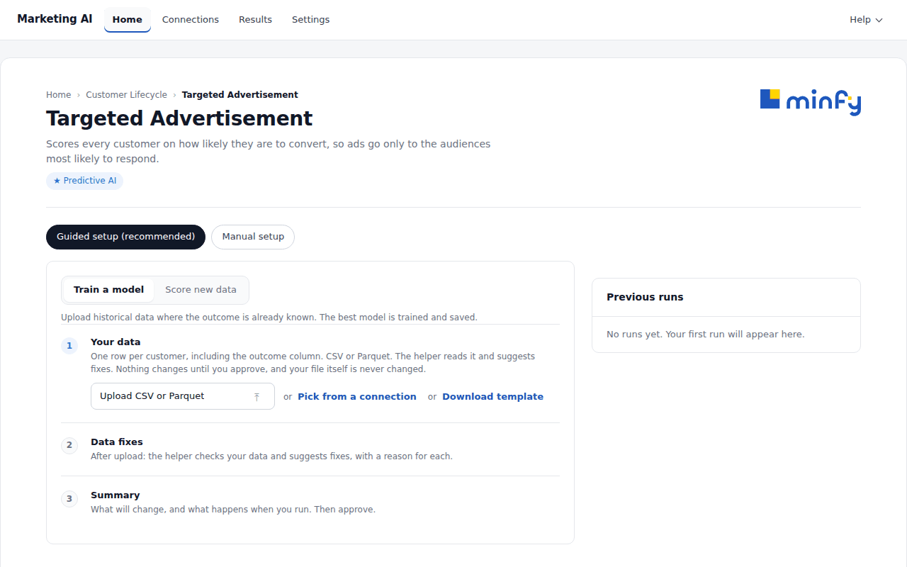
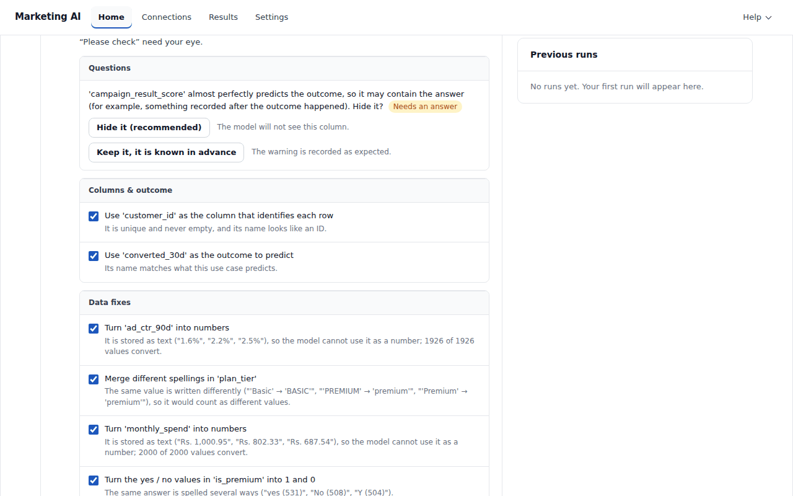
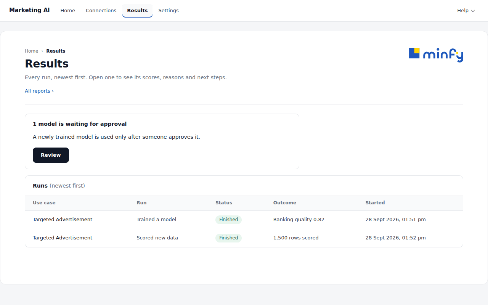
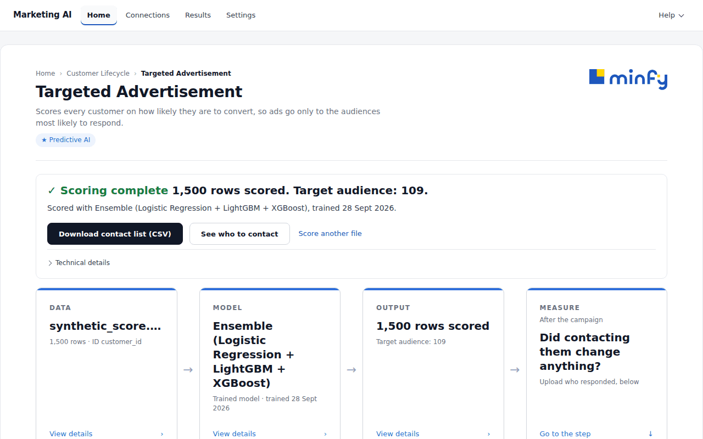
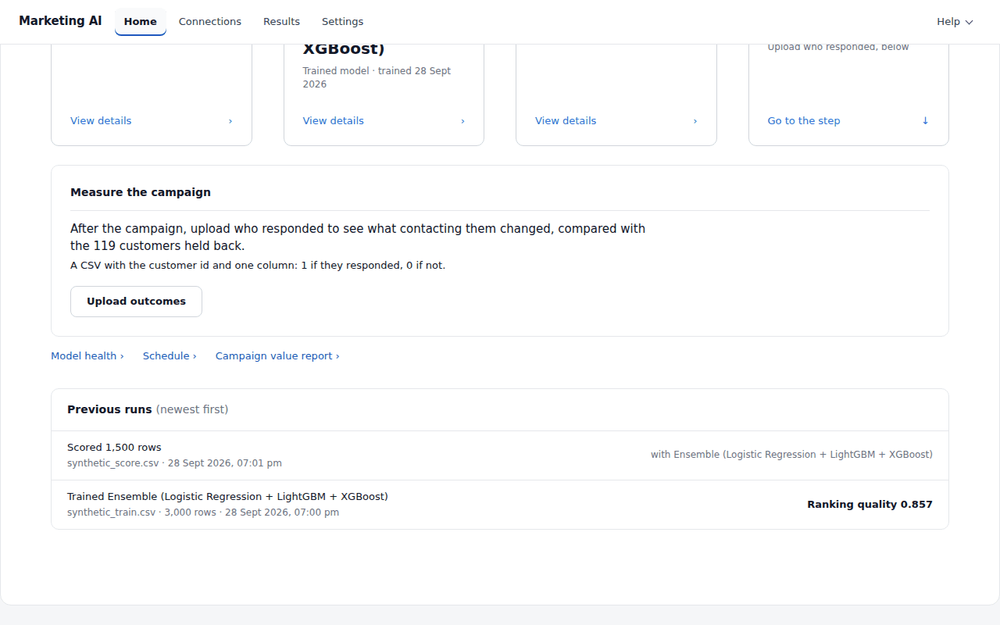
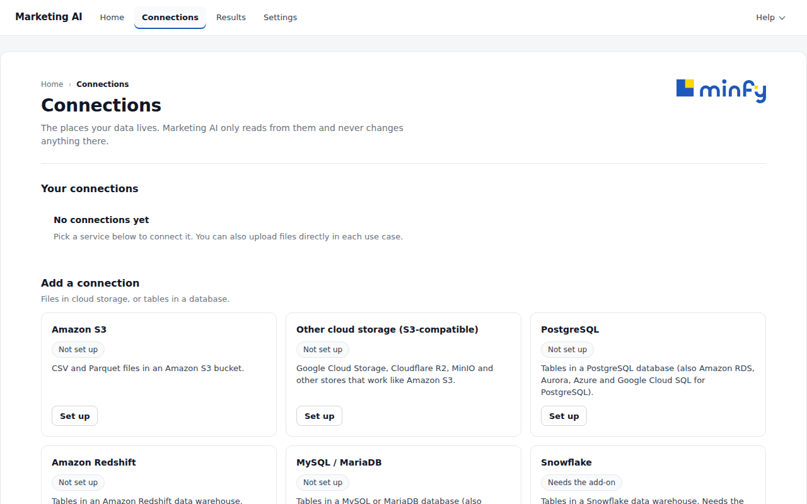
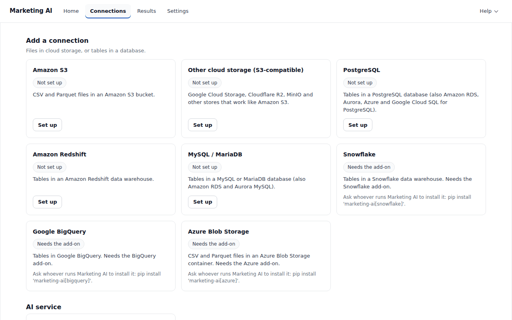
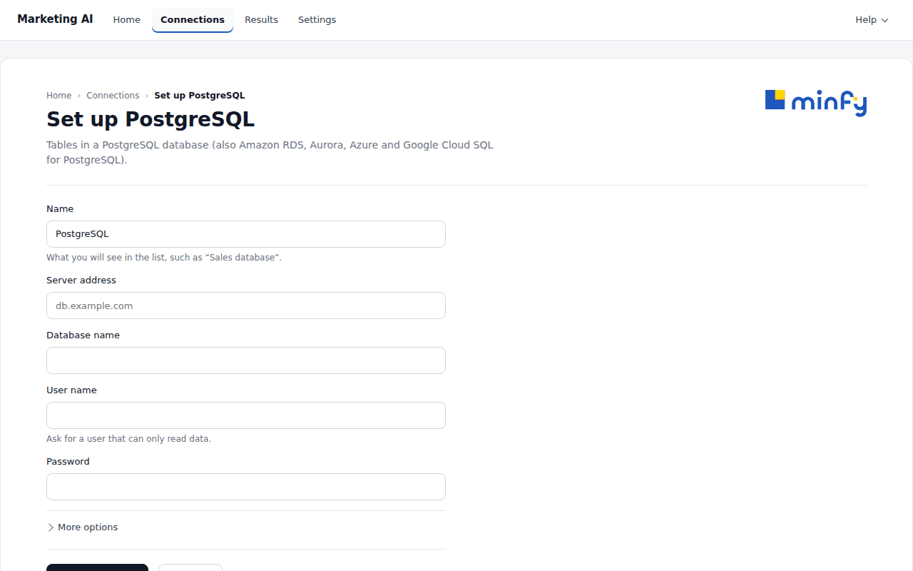
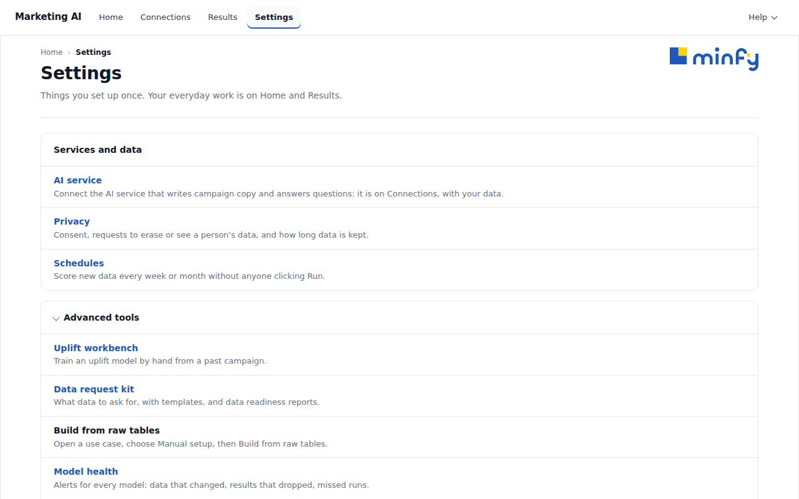

# Start here 👋

A short guide for marketers. You do not need to be a data scientist to use Marketing AI.

## What it does

- You give it a file of your customers (or point it at where that data lives).
- It learns from what happened before and scores every customer: who will buy, pay, leave or come back.
- For each customer you get a score, a reason and a suggested action. After a campaign, it shows what the campaign really changed.

## 🚀 Start it

Someone on your team runs this once, in the project folder:

```bash
make setup                   # first time only: installs everything
make run                     # uvicorn api.main:app on :8000
# then open http://localhost:8000/ui
```

The product starts empty. There is no sample data and no other company's numbers: everything you see comes from your own files.

Sign-in is off by default, so it is a single-user tool: whoever opens the page can do everything.

## 🧭 The four pages

The bar at the top has four places. That is all you need.

| Page | What it is for |
|---|---|
| **Home** | Pick what you want to do. The use cases are grouped by goal: *Win customers*, *Keep them paying*, *Stop them leaving*, *Win them back* and, last, *Run smoothly* (operations). |
| **Connections** | Connect the places your data lives: cloud storage or a database. Optional: you can always upload a file instead. |
| **Results** | Every run, newest first. Open one to see its scores, reasons and next steps. |
| **Settings** | Things you set up once: privacy, schedules and the advanced tools. You rarely need it. |



## 🧩 Using a use case, step by step

Click a use case on Home, for example **Targeted Advertisement**. It opens on **Guided setup (recommended)**. **Manual setup** is one click away if you prefer to fill in every choice yourself.

At the top, choose **Train a model** (your first time: a file where you already know the outcome) or **Score new data** (later: new customers, without the outcome).



### 1. Choose your data 📁

Under **Your data**, do one of these:

- **Upload CSV or Parquet**: one row per customer. For training, include the column with the outcome (for example, whether they bought).
- **Pick from a connection**: choose a saved connection, open a folder or schema, pick a file or a table. You see its first rows (personal details are hidden in this preview), then click **Import**. From here on it works exactly like an uploaded file.
- Not sure which columns you need? **Download template** shows them.

Your own file is never changed.

### 2. Guided setup: the helper checks your data ✅

The helper reads your file and makes a short checklist. Each item has a plain reason and the numbers behind it.

- **Columns & outcome**: which column identifies each customer, and which one is the outcome to predict.
- **Data fixes**: for example "Turn 'monthly_spend' into numbers" when money was written as text, or "Merge different spellings in 'plan_tier'".
- **Settings: Auto (recommended)**: any change it suggests to the run's settings. Everything else keeps the recommended value.
- **Questions**: when it cannot decide alone, it asks. A question marked **Needs an answer** must be answered before you can approve. For example, a column that almost perfectly predicts the outcome may contain the answer: you choose **Hide it (recommended)** or **Keep it**.

Ticked items are applied when you approve. Untick any you do not want. Items marked **Please check** need your eye. You can also ask the helper questions in the chat box ("Ask the helper…"). Without an AI service the chat gives practice answers; the checklist works the same either way.

Then click **Approve**. The fixes are applied to a *copy* of your file. The same fixes are saved with the model, so next month's file is prepared the same way before it is scored.



### 3. Run and see the results 📊

After you approve, click **Run training** (or **Score data** when scoring). A training run takes a few minutes.

- A **training run** tells you how good the model is, in plain words.
- A **scoring run** gives every customer a score, a reason and an action. Use **Download contact list (CSV)** or **See who to contact**.
- Under a finished run you also find **Model health**, **Schedule** and the run's **report**.

A newly trained model waits for approval before it is the one in use. Results shows "1 model is waiting for approval" with a **Review** button. You can already score with the new model before it is approved.





### 4. Measure the campaign 🎯

Only for use cases that contact customers (ads, cross-sell, payment reminders, retention, win-back). Operational use cases, *Order Fulfillment* and *Fault Prediction*, do not have this step.

When you score customers for a campaign, a small group (10% by default) is held back and not contacted. After the campaign, open the scoring run and go to **Measure the campaign**, the last step on its page:

1. Click **Upload outcomes**: a CSV with the customer id and one column, 1 if they responded and 0 if not.
2. You get one plain answer, such as "The campaign added about 180 conversions", "No clear effect yet" or "Outcome window not over yet", with the response rates of the contacted and held-back customers.
3. When the campaign is big enough, **Learn who to contact next time** trains a model that finds the customers the contact really changes.



## 🔌 Adding a connection

Go to **Connections**. Under **Add a connection**, click **Set up** on a service:

| Service | What you need |
|---|---|
| Amazon S3 | a bucket name; keys are optional (blank uses the server's own AWS sign-in) |
| Other cloud storage (S3-compatible): Google Cloud Storage, Cloudflare R2, MinIO | the storage address, bucket, access key ID and secret |
| PostgreSQL (also Amazon RDS, Aurora, Cloud SQL) | server address, database name, user name, password |
| Amazon Redshift | server address, database name, user name, password |
| MySQL / MariaDB | server address, database name, user name, password |
| Snowflake, Google BigQuery, Azure Blob Storage | optional add-ons: until installed, their card says **Needs the add-on** and names the command to give whoever runs Marketing AI |





Fill in the short form (ports and other rare options are under **More options**) and click **Save and test**. The test runs five steps, each with a result and, when it fails, what to fix:

1. Reach the service
2. Sign in
3. List what is there
4. Read a sample
5. Check it is read-only



Good to know 🔒

- **Marketing AI only reads.** It imports a copy and never changes anything in your systems. Ask your IT team for a user that can only read. If the user could write, the test shows a safety tip.
- **Passwords and keys stay on the server.** They are stored encrypted, never sent back to your browser, and not written to logs or the audit log. When you edit a connection, a saved password shows "Saved. Leave blank to keep it."
- The **AI service** (Amazon Bedrock) is also on Connections: **Open and test**. It writes summaries, campaign copy and chat answers. Everything else works without it.

## ⚙️ Where did the other tools go?

Rarely used tools are under **Settings**. Open **Advanced tools** to find:

- **Uplift workbench**: train an uplift model by hand from a past campaign.
- **Data request kit**: what data to ask for, with templates, and data readiness reports.
- **Build from raw tables**: open a use case, choose **Manual setup**, then **Build from raw tables**.
- **Model health**: alerts for every model.
- **Document assistant**: answers questions from your own documents (needs the AI service).

**Privacy** (consent, requests to erase or see a person's data, retention) and **Schedules** (score new data every week or month) are at the top of Settings. **All reports** is a link at the top of Results.



## 🛟 If something goes wrong

An error always starts with a plain sentence. Click **Details** to see its code (for example `PK_NOT_UNIQUE`) if you need to ask for help. Where there is a **Try again** button, it loads the screen again.

| You see | What to do |
|---|---|
| "We could not reach Marketing AI. Check your connection and try again." | The server is not running or not reachable. Ask whoever started it to run `make run` again. |
| Guided setup says **This data cannot be used as it is** | Read the reason under it. Then **Upload another file**, or **Use Manual setup instead**. |
| "The same customer ID appears on more than one row" (`PK_NOT_UNIQUE`) | Keep one row per customer (for example the latest), then upload again. |
| "The outcome column is missing" (`TARGET_MISSING`) | Add the outcome column from the template, or use **Build from raw tables**. |
| "Too few customers had the outcome" (`TARGET_TOO_FEW_POSITIVES`) or "Too few rows" (`ROWS_TOO_FEW`) | Send more history or more customers. |
| "A column seems to contain the answer" (`LEAKAGE_SUSPECTED`) | Hide that column, or send its value as it was before the outcome date. |
| "The dates cannot be read" (`TIME_COLUMN_UNPARSEABLE`) | Write dates as YYYY-MM-DD (for example 2026-08-31). |
| "The new file does not match the one the model learned from" (`SCHEMA_MISMATCH`) or "A column the model prepares is missing" (`RECIPE_COLUMN_MISSING`) when scoring | Export the new file with the same columns as the training file, or open Guided setup and tell the helper what the column is called now. |
| **Approve** is greyed out: "Answer the questions marked “Needs an answer” first." | Answer each question marked **Needs an answer**. |
| A connection test says "Not connected yet. Fix the first problem below, then test again." | Read the first step with a ✕: it says what to fix (address, password, permissions). |
| A connection card says **Needs the add-on** | Ask whoever runs Marketing AI to install it, with the command shown on the card. |
| "The saved password or key can no longer be read. Edit the connection and enter it again." | The server's encryption key changed. Edit the connection and type the password again. |
| Step 4 says "Outcome window not over yet" | Customers still have time to respond. Upload the outcomes again on or after the date shown. |
| Step 4 says "No customer in this file is on the list" | Check the file holds the outcomes of *this* campaign, with the same customer id column. |

More detail, for the people who run Marketing AI: [CONNECTIONS.md](CONNECTIONS.md) (connections and secrets), [AGENTS.md](AGENTS.md) (how the Guided setup helper works) and [UPLIFT.md](UPLIFT.md) (measuring campaigns).

To refresh the screenshots on this page: `python -m scripts.capture_start_here` (it uses synthetic data only).
